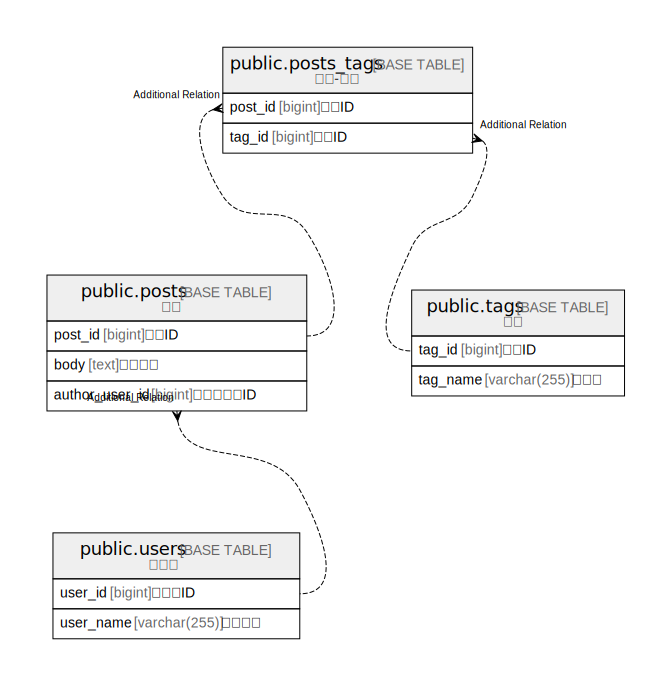

# example

## Tables

| Name | Columns | Comment | Type |
| ---- | ------- | ------- | ---- |
| [public.posts](public.posts.md) | 3 | 投稿 | BASE TABLE |
| [public.posts_tags](public.posts_tags.md) | 2 | 投稿-タグ | BASE TABLE |
| [public.tags](public.tags.md) | 2 | タグ | BASE TABLE |
| [public.users](public.users.md) | 2 | ユーザ | BASE TABLE |

## Relations

---

> Generated by [tbls](https://github.com/k1LoW/tbls)
