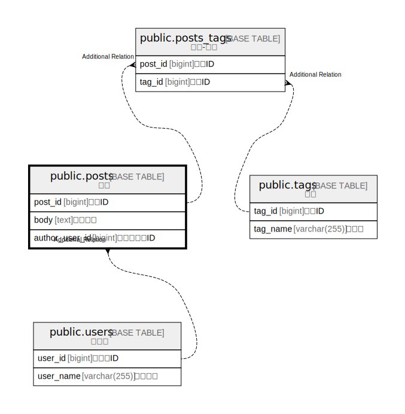

# public.posts

## Description

投稿

## Columns

| Name | Type | Default | Nullable | Children | Parents | Comment |
| ---- | ---- | ------- | -------- | -------- | ------- | ------- |
| post_id | bigint | nextval('posts_post_id_seq'::regclass) | false |  |  | 投稿ID |
| body | text |  | false |  |  | 投稿内容 |
| author_user_id | bigint |  | false |  |  | 作成ユーザID |

## Constraints

| Name | Type | Definition |
| ---- | ---- | ---------- |
| posts_pkc | PRIMARY KEY | PRIMARY KEY (post_id) |

## Indexes

| Name | Definition |
| ---- | ---------- |
| posts_pkc | CREATE UNIQUE INDEX posts_pkc ON public.posts USING btree (post_id) |

## Relations

---

> Generated by [tbls](https://github.com/k1LoW/tbls)
