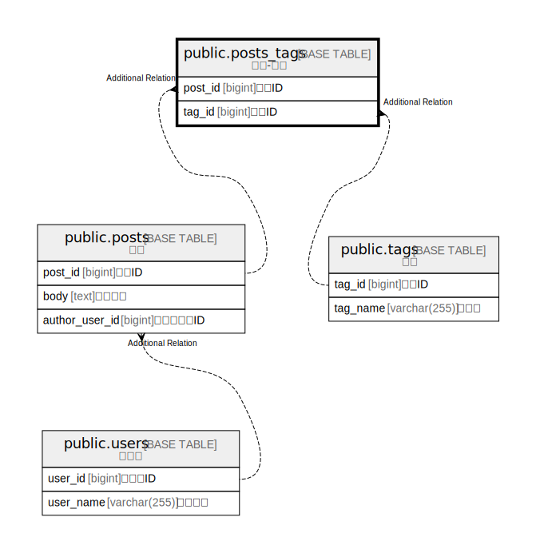

# public.posts_tags

## Description

投稿-タグ

## Columns

| Name | Type | Default | Nullable | Children | Parents | Comment |
| ---- | ---- | ------- | -------- | -------- | ------- | ------- |
| post_id | bigint |  | false |  |  | 投稿ID |
| tag_id | bigint |  | false |  |  | タグID |

## Constraints

| Name | Type | Definition |
| ---- | ---- | ---------- |
| posts_tags_pkc | PRIMARY KEY | PRIMARY KEY (post_id, tag_id) |

## Indexes

| Name | Definition |
| ---- | ---------- |
| posts_tags_pkc | CREATE UNIQUE INDEX posts_tags_pkc ON public.posts_tags USING btree (post_id, tag_id) |

## Relations

---

> Generated by [tbls](https://github.com/k1LoW/tbls)
