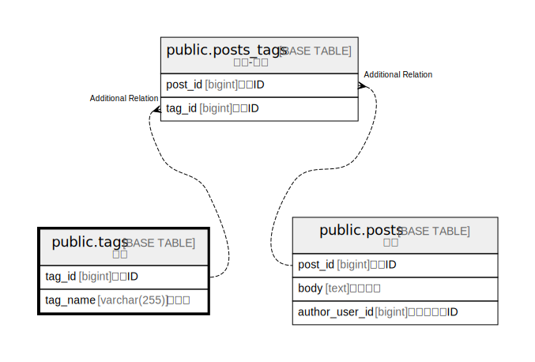

# public.tags

## Description

タグ

## Columns

| Name | Type | Default | Nullable | Children | Parents | Comment |
| ---- | ---- | ------- | -------- | -------- | ------- | ------- |
| tag_id | bigint | nextval('tags_tag_id_seq'::regclass) | false | [public.posts_tags](public.posts_tags.md) |  | タグID |
| tag_name | varchar(255) |  | false |  |  | タグ名 |

## Constraints

| Name | Type | Definition |
| ---- | ---- | ---------- |
| tags_pkc | PRIMARY KEY | PRIMARY KEY (tag_id) |

## Indexes

| Name | Definition |
| ---- | ---------- |
| tags_pkc | CREATE UNIQUE INDEX tags_pkc ON public.tags USING btree (tag_id) |

## Relations

---

> Generated by [tbls](https://github.com/k1LoW/tbls)
