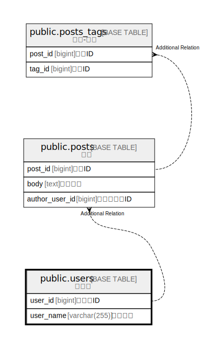

# public.users

## Description

ユーザ

## Columns

| Name | Type | Default | Nullable | Children | Parents | Comment |
| ---- | ---- | ------- | -------- | -------- | ------- | ------- |
| user_id | bigint | nextval('users_user_id_seq'::regclass) | false |  |  | ユーザID |
| user_name | varchar(255) |  | false |  |  | ユーザ名 |

## Constraints

| Name | Type | Definition |
| ---- | ---- | ---------- |
| users_pkc | PRIMARY KEY | PRIMARY KEY (user_id) |

## Indexes

| Name | Definition |
| ---- | ---------- |
| users_pkc | CREATE UNIQUE INDEX users_pkc ON public.users USING btree (user_id) |

## Relations

---

> Generated by [tbls](https://github.com/k1LoW/tbls)
